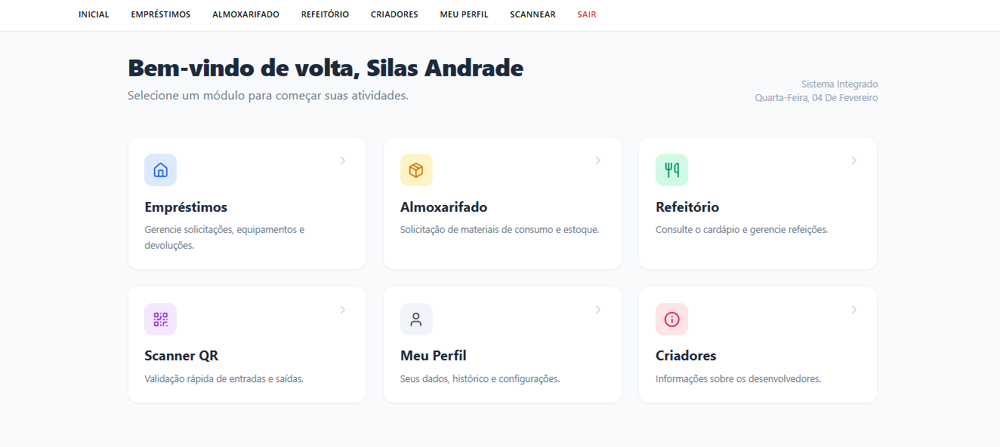

# SIGE IFBAIANO

## 📋 Overview

SIGE is an integrated management system developed during my IT internship. This project aims to simplify administrative and academic processes through a centralized and intuitive platform.

## 🤝 Contributors

My colleagues who contributed to the project during my internship:

<table>
  <tr>
    <td align="center"> 
      <a href="https://github.com/Ghs-d" title="Front-End Developer"> 
      
        
       
        <b>
          Guilherme
        </b> 
       
    </a> 
    </td> 
    <td align="center"> 
      <a href="https://github.com/LucasmystOS" title="Back-End Developer"> 
      
        
       
        <b>
          Lucas Da Hora Vieira
        </b> 
       
    </a> 
    </td> 
  </tr>
</table>

## 📄 License

This project is licensed under the MIT license. See the [LICENSE](LICENSE) file for more details.
